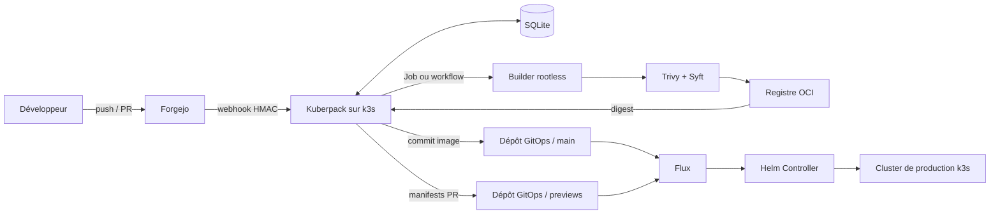

# Architecture

Kuberpack et le builder s’installent sur **k3s**. Le cluster de production est aussi du k3s, mais Kuberpack ne s’y authentifie pas : il n’écrit que Git.



Deux clusters (ou deux namespaces fortement isolés) sont le déploiement sain : builds d’un côté, trafic de l’autre. Un nœud unique est possible ; ce n’est pas une exigence du produit.

## Plans

| Plan | Où ça tourne | Rôle |
| --- | --- | --- |
| Control plane | k3s | API, webhooks, file, promotion Git |
| Build | k3s, namespace isolé, BuildKit rootless | Image + scan + push |
| Production | k3s GitOps | HelmRelease, ingress, secrets |
| Git | Forgejo | Code apps, registre optionnel, dépôt GitOps |

## Sources de vérité

| Élément | Source |
| --- | --- |
| Code applicatif | Dépôt de l’application |
| Catalogue d’apps, builds, previews | SQLite de Kuberpack |
| Image | Registre OCI |
| Digest demandé en production | Branche `main` du dépôt GitOps |
| Manifests de preview | Branche `previews` du dépôt GitOps |
| Release réellement active | Historique Helm |
| Cluster (hors apps PaaS) | Même dépôt GitOps, Flux |
| Secrets applicatifs | Gestionnaire de secrets → Secret K8s |

## Control plane

Service long-lived, Go (`net/http` + SQLite). Une réplique, `Recreate`, volume WAL.

Il doit :

- exposer l’API d’enregistrement ;
- créer webhook HMAC et clé SSH de deploy read-only sur Forgejo ;
- répondre tout de suite (`202`) et traiter hors requête ;
- sérialiser les builds par application et branche ;
- dispatcher le builder, enregistrer `{image, tag, digest}` ;
- committer le champ `image` ;
- gérer la branche `previews` ;
- publier statuts et URL sur Forgejo ;
- garbage-collecter les previews.

Il ne doit pas : construire l’image dans son processus, parler à l’API Kubernetes de production, pousser dans un dépôt applicatif.

## Builder

Processus isolé sur k3s. Contrat : SHA in, digest out. Détail dans [builder](builder.md). L’implémentation (Forgejo Actions, Job `batch/v1`) est interchangeable tant que le contrat tient.

## GitOps

Après un build valide, un seul écrivain automatique (Kuberpack) pose :

```text
image: <registry>/<app>:sha-<commit>@sha256:<digest>
```

Le champ `track` du même `values.yaml` dit quel commit est désiré (`main` ou un SHA). Kuberpack ne réécrit que `image`. Un `track` figé réutilise le digest déjà publié, sans Job.

Le commit est petit, message explicite, manifeste rendu (`helm template` / kustomize) **avant** le push. Pas de tag mutable `main` comme source de déploiement.

Les apps PaaS sont des `HelmRelease` d’un chart **stateless** : Deployment, Service, Ingress, probes, PSA `restricted`, `envFrom`, ressources, NetworkPolicy, Helm test HTTP.

```yaml
spec:
  test:
    enable: true
  upgrade:
    remediation:
      retries: 1
      strategy: rollback
      remediateLastFailure: true
```

À l’enregistrement (production seulement), `values.yaml` déclare :

```yaml
envFrom:
  - secretRef:
      name: app-<name>
```

Kuberpack ne crée pas ce Secret et n’en lit pas les clés. Un administrateur le remplit (Infisical → Secret Kubernetes, ou `kubectl` / autre gestionnaire) dans le namespace de release (`apps` par défaut). Clés typiques : `STRIPE_SECRET_KEY`, `DATABASE_URL`. Tant que l’objet Secret n’existe pas, le pod ne démarre pas (`CreateContainerConfigError`) : le binding est visible. Un Secret vide démarre le process sans variables.

Kuberpack et Flux ne connaissent pas Stripe ni Postgres. Ils savent seulement que le workload **monte** `app-<name>`.

Stateful (Postgres, Valkey, …) : hors chart, GitOps classique. L’app les voit comme des variables dans ce même Secret.

Rollback Helm : le cluster peut tourner une révision plus ancienne que Git. Le produit affiche `rolled_back`. Réécrire Git automatiquement est hors MVP.

## Branches du dépôt GitOps

**`main`** — cluster durable, chart, HelmRelease, digests de production.

**`previews`** — générée, reconstructible, aucun secret, Flux `prune: true`.
