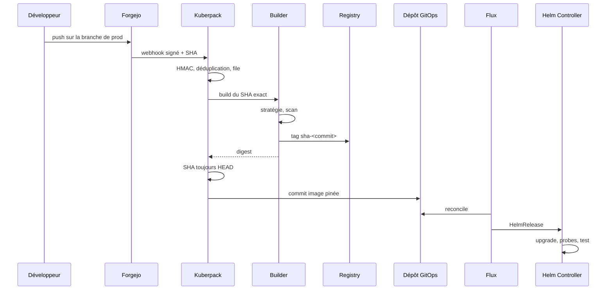

# Flux

## Enregistrement

```http
POST /api/v1/apps
```

Champs : [API](api.md).

Kuberpack vérifie le dépôt, l’inscrit, crée le secret HMAC (hors SQLite), pose le webhook Forgejo (`push`, `pull_request`) et une clé de deploy read-only, puis lance le premier build.

Le manifeste de production initial peut être créé à la main dans le dépôt GitOps tant que le chart n’est pas stable. Ensuite Kuberpack ne change plus que le champ `image`. Rien n’est écrit dans le dépôt applicatif.

## Production



- échec de build ou de scan → Git inchangé ;
- seul le HEAD courant de la branche peut être promu ;
- un job lent ne remplace pas un SHA plus récent ;
- un seul bot committe les digests applicatifs.

## Previews

Un drapeau : `autodeploy_pr: true`.

- release `<app>-pr-<numero>` ;
- hôte `pr-<numero>.<app>.<preview-domain>` ;
- quota, PSA `restricted`, ressources inférieures à la prod ;
- aucun secret de production ;
- forks ignorés sans approbation ;
- TTL + GC si le webhook `closed` est perdu.

Fermer la PR supprime le manifeste ; Flux prune.

## Webhook HTTP

HMAC faux → `401`. JSON invalide → `400`. Événement hors périmètre → `204`. Accepté → `202` immédiat, travail en file. Reprise au redémarrage depuis SQLite.
